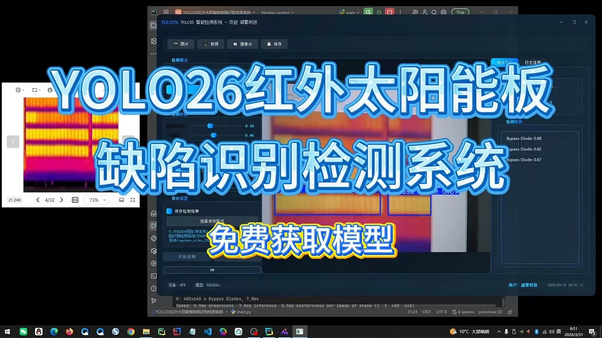
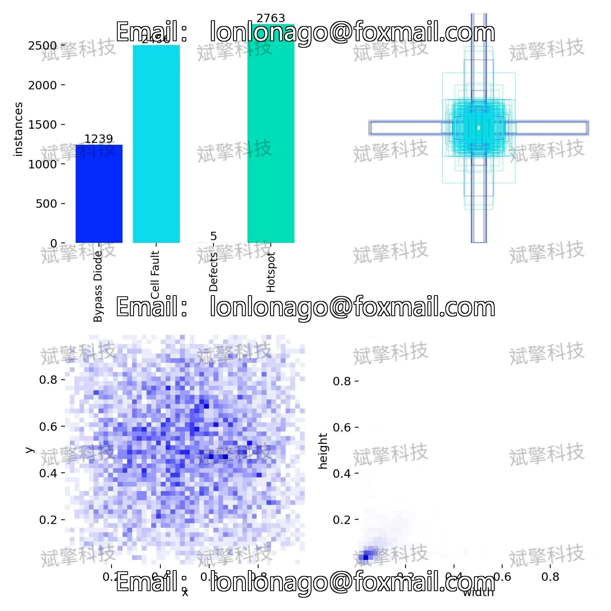
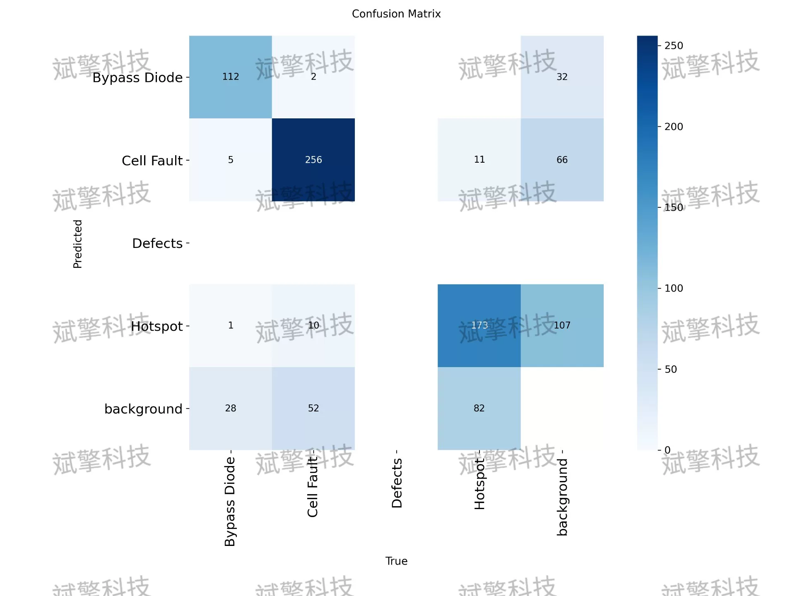
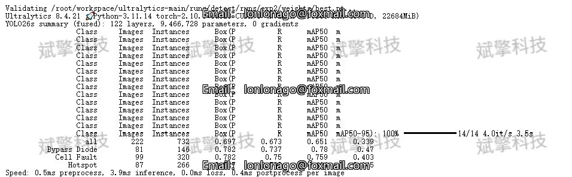
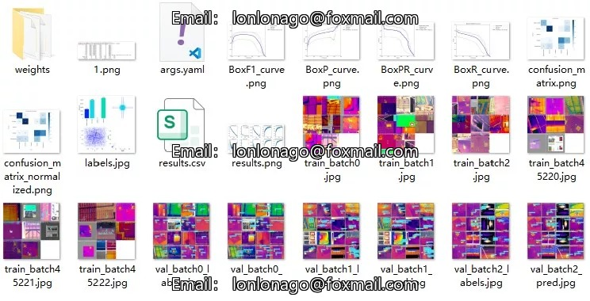
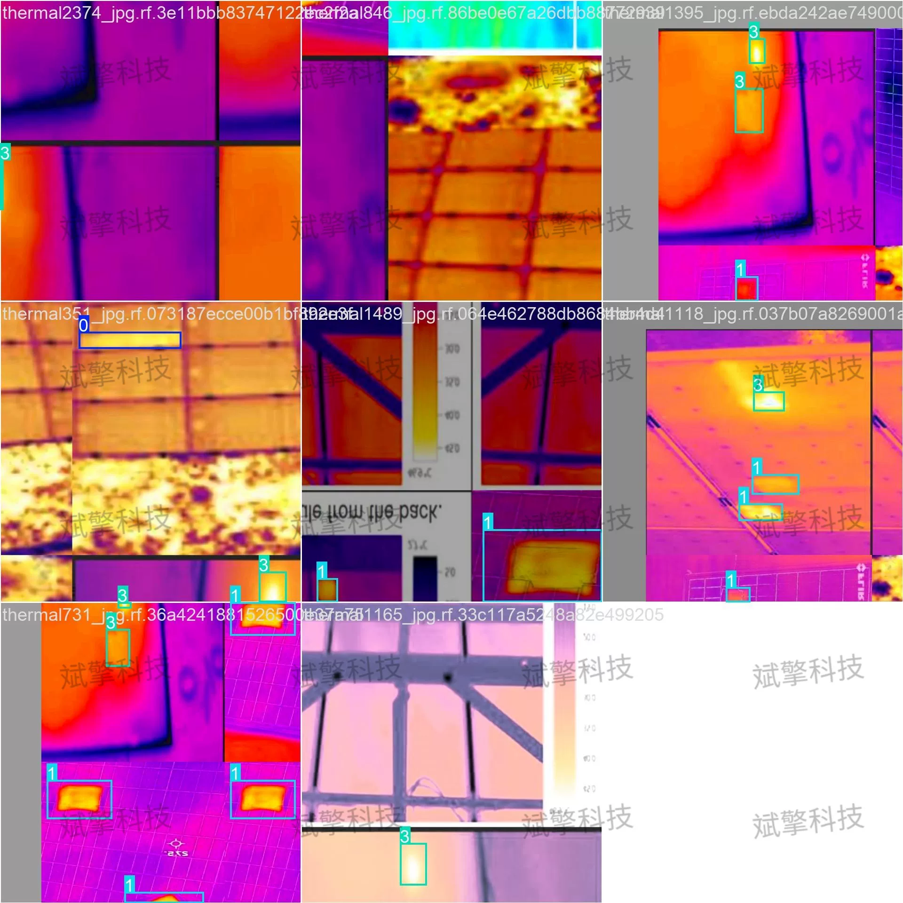
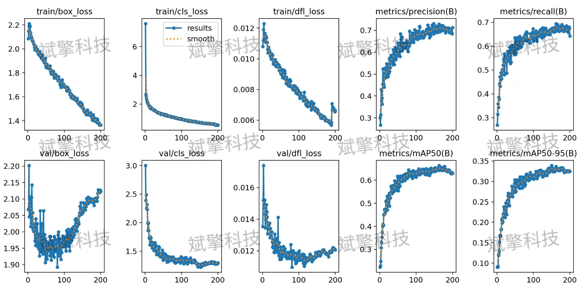
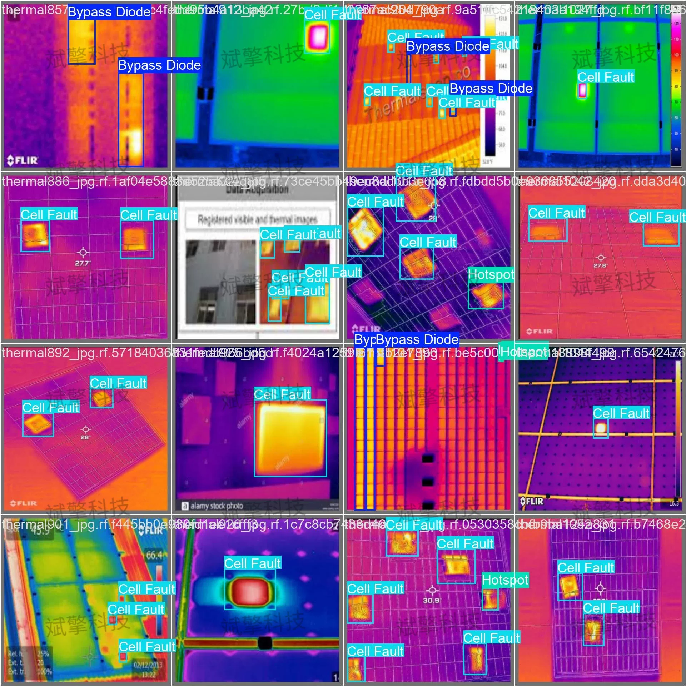
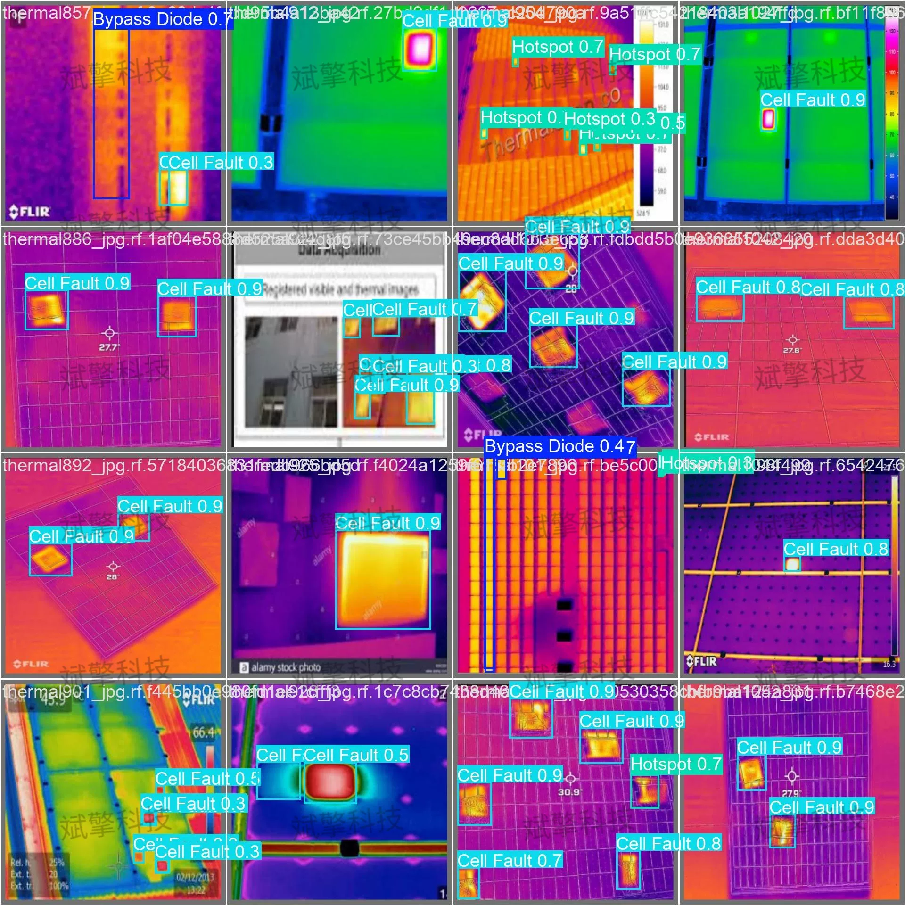

# YOLO26 Infrared Solar Panel Defect Identification and Detection System

## Body

YOLO26 Infrared Solar Panel Defect Detection System (Project Source Code + Dataset + Model Weights + UI Interface + Python + Deep Learning + Remote Environment Deployment)

With the continuous expansion of photovoltaic power stations, the detection of solar panel defects has become a crucial link in ensuring the efficiency and safety of power generation. Traditional manual inspection methods are inefficient and subjective, unable to meet the real-time monitoring needs of large-scale power stations. This paper builds an automatic recognition system for typical defects in solar panels based on the YOLO26 object detection algorithm. The system can identify four types of defects: Bypass Diode (abnormal bypass diode), Cell Fault (battery cell fault), Defects (other defects), and Hotspot (hot spot). The experimental dataset was built using self-collected infrared image data, including 1897 training images, 222 validation images, and 113 test images.

The dataset contains four categories of solar panel defects, as follows:
Bypass Diode    Anomalous bypass diode, usually manifested as localized temperature abnormal increase or failure
Cell Fault    Battery cell fault, such as cracks, fragmentation, aging, etc. leading to performance decline
Defects    Surface dirt, wiring box abnormality, etc.
Hotspot    Hotspot effect caused by local obstruction or mismatch between cells

Free appointment for remote installation. Unsuccessful installation will result in full refund.
Purchase includes the following resources (unlocked in Baidu Cloud):
     YOLO identification detection project complete source code
    ️ YOLO format dataset
      Training code + UI interface code
      Trained model + results image
      Software installer package
    ️ Add WeChat to make an appointment for remote installation (automatically displayed WeChat ID after purchase) - Unsuccessful, full refund

⚙️ Core function modules
Detection capability
    Image detection: upload and detect, return detection boxes + category information
    Video detection: supports video files, analyze each frame accurately
    Camera real-time detection: connect USB camera, realize dynamic monitoring
Interaction and control
    Target selection: freely choose one or more categories for detection
    Parameter real-time adjustment: adjustable confidence threshold & IoU threshold, flexible control accuracy
    Result saving: save images/videos/camera detection results in one click
System and data
    User login registration: support password strength detection + encrypted storage
    Log recording: automatically record operation and error information (timestamped)

## Images

## Payment

Here is a pay link on Stripe ( https://buy.stripe.com/3cs8yP7sY87d0vu9AB ). Please contact me lonlonago@foxmail.com after funding $89, and I will send you a complete data files , thank you!

